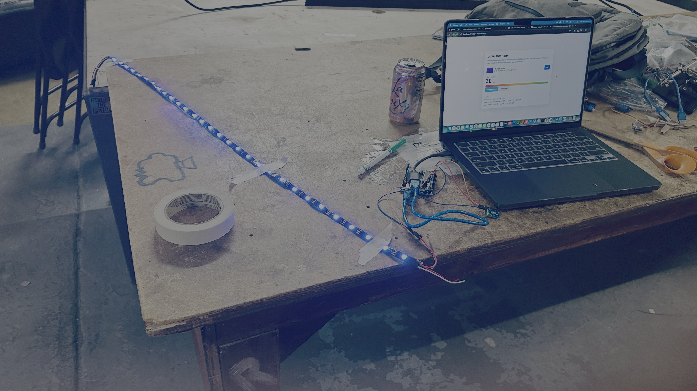
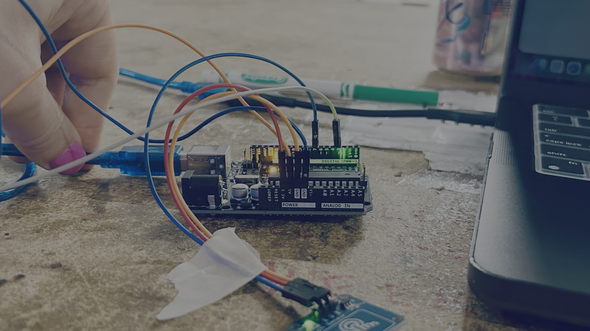
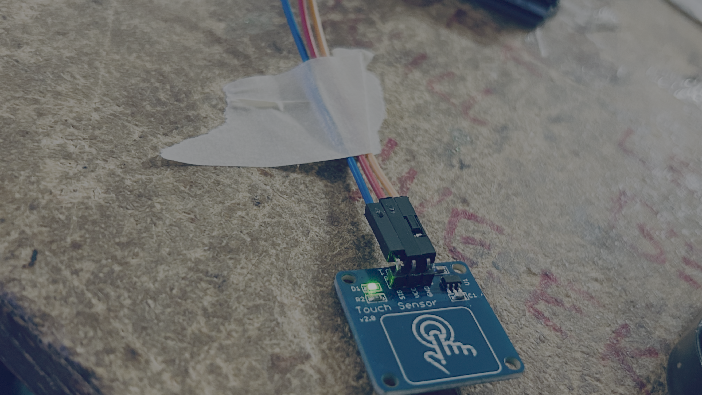
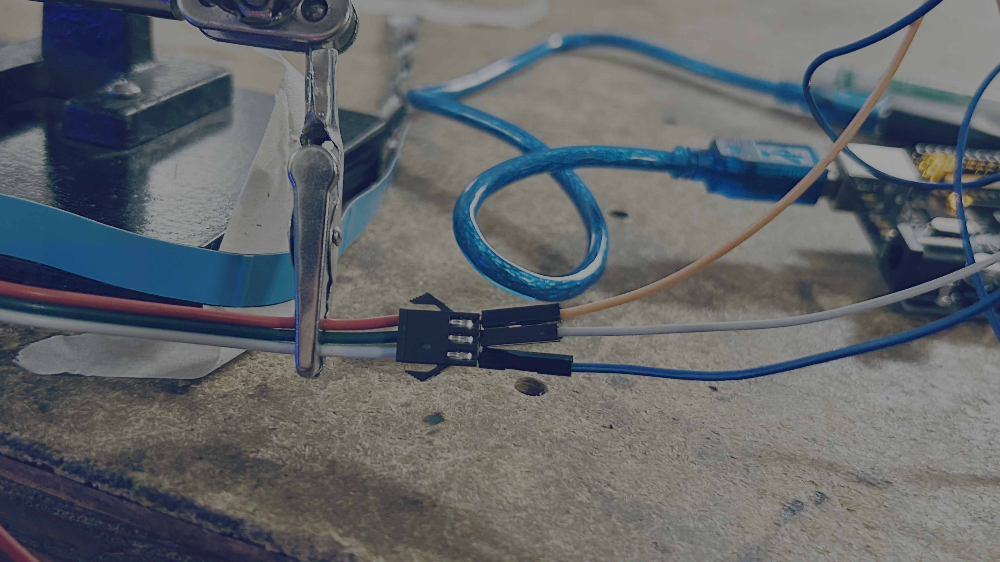

# ❤️ Love Detector

## Project

Can electronics measure love? Probably not... but they can make a pretty convincing light show!

In this project, you'll build a **Love Detector** using an Arduino, a touch sensor, and an RGB LED strip. Touch the sensor to trigger colorful LED animations while a companion website calculates your totally scientific love score.

Experiment with different touches and see if true love is hiding in your fingertips!

<video controls src="https://storage.googleapis.com/noah-education-videos/circuithackingmondays/love-detector.mov" ></video>





## 🔌 Wires



| Arduino Pin | Component | Component Pin |
| ------------ | --------- | ------------- |
| 3V | Touch Sensor | VCC |
| GND | Touch Sensor | GND |
| D7 | Touch Sensor | OUT |
| 5V | RGB LED Strip | 5V |
| GND | RGB LED Strip | GND |
| D3 | RGB LED Strip | DIN |





## 💻 Code

```cpp
#include <FastLED.h>

#define LED_PIN 3
#define TOUCH_PIN 7
#define NUM_LEDS 30
#define LED_TYPE WS2812B
#define COLOR_ORDER GRB
#define BRIGHTNESS 20

CRGB leds[NUM_LEDS];

bool lastTouchState = LOW;
String inputLine;

void setStripColor(uint8_t red, uint8_t green, uint8_t blue, uint8_t loveLevel) {
  fill_solid(leds, NUM_LEDS, CRGB::Black);

  for (uint8_t i = 0; i < loveLevel && i < NUM_LEDS; i++) {
    leds[i] = CRGB(red, green, blue);
  }

  FastLED.show();
}

bool parseRgbCommand(const String& line, uint8_t& red, uint8_t& green, uint8_t& blue, uint8_t& loveLevel) {
  if (!line.startsWith("R-G-B")) {
    return false;
  }

  int firstNumber = -1;
  for (int i = 0; i < line.length(); i++) {
    if (isDigit(line[i])) {
      firstNumber = i;
      break;
    }
  }

  if (firstNumber < 0) {
    return false;
  }

  int values[4] = {0, 0, 0, NUM_LEDS};
  int valueIndex = 0;
  int currentValue = 0;
  bool readingNumber = false;

  for (int i = firstNumber; i <= line.length(); i++) {
    char character = i < line.length() ? line[i] : ',';

    if (isDigit(character)) {
      currentValue = currentValue * 10 + (character - '0');
      readingNumber = true;
      continue;
    }

    if (readingNumber) {
      if (valueIndex >= 4) {
        return false;
      }

      values[valueIndex] = constrain(currentValue, 0, 255);
      valueIndex++;
      currentValue = 0;
      readingNumber = false;
    }
  }

  if (valueIndex < 3) {
    return false;
  }

  red = values[0];
  green = values[1];
  blue = values[2];
  loveLevel = constrain(values[3], 0, NUM_LEDS);
  return true;
}

void handleSerialLine(String line) {
  line.trim();

  uint8_t red;
  uint8_t green;
  uint8_t blue;
  uint8_t loveLevel;

  if (parseRgbCommand(line, red, green, blue, loveLevel)) {
    setStripColor(red, green, blue, loveLevel);
    Serial.print("OK ");
    Serial.print(red);
    Serial.print(",");
    Serial.print(green);
    Serial.print(",");
    Serial.print(blue);
    Serial.print(" LOVE ");
    Serial.println(loveLevel);
  } else if (line.length() > 0) {
    Serial.print("ERR ");
    Serial.println(line);
  }
}

void readSerialInput() {
  while (Serial.available() > 0) {
    char incoming = Serial.read();

    if (incoming == '\n') {
      handleSerialLine(inputLine);
      inputLine = "";
    } else if (incoming != '\r') {
      inputLine += incoming;
    }
  }
}

void setup() {
  pinMode(TOUCH_PIN, INPUT);
  Serial.begin(115200);

  FastLED.addLeds<LED_TYPE, LED_PIN, COLOR_ORDER>(leds, NUM_LEDS);
  FastLED.setBrightness(BRIGHTNESS);
  setStripColor(0, 0, 0, 0);
}

void loop() {
  readSerialInput();

  bool touchState = digitalRead(TOUCH_PIN);
  if (touchState == HIGH && lastTouchState == LOW) {
    Serial.println("LOVE");
    delay(35);
  }

  lastTouchState = touchState;
}

```

### Try Changing the Code

Experiment with:

- Different LED colors.
- Faster or slower animations.
- Rainbow effects.
- Sparkle patterns.
- Your own love messages on the website.


## 📝 Memories

