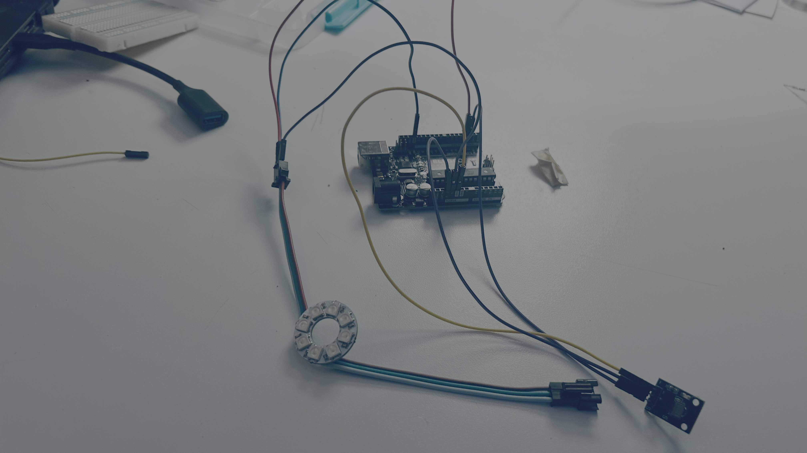
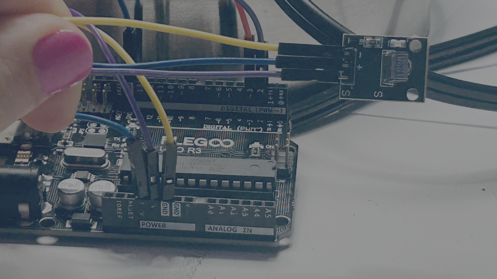
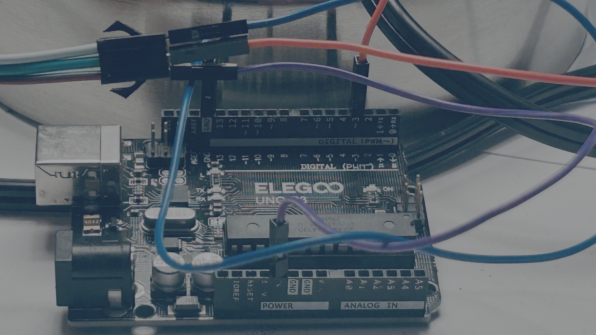

# Circuit Hacking Monday: Remote Controlled Light

<video controls src="https://storage.googleapis.com/noah-education-videos/circuithackingmondays/remote-controlled-lights.mov" ></video>

## 🛠️ Project

Using IR Remote you will control and LED Light Strip.



| Remote Button | Effect |
|--------------|--------|
| 1 | ❤️ Blinking Red |
| 2 | 🌈 Rotating Rainbow |
| 3 | 🎭 Theater Chase |
| 4 | 🚓 Scanner |
| 5 | ☄️ Comet |


## 🔌 Wires 






| Arduino Pin | Component | Component Pin |
|-------------|-----------|---------------|
| 5V | NeoPixel Ring | 5V |
| GND | NeoPixel Ring | GND |
| 3 | NeoPixel Ring | DIN |
| 3.3v | IR Receiver | VCC |
| GND | IR Receiver | GND |
| 2 | IR Receiver | OUT |

---

## 💻 Code

### Libraries Used

- IRremote
- FastLED

### C++ Code

```cpp
#include <IRremote.hpp> // Include the IRremote library for infrared communication
#include <FastLED.h>

bool developer_ir_remote_found = false; // whether ir remote was pressed
int developer_ir_remote_command = -1; // the button pressed by the ir remote

#define PIN_DATA 3
#define NUM_LEDS 8
CRGB leds[NUM_LEDS];
uint8_t baseHue = 0;
int scannerPosition = 0;
int scannerDirection = 1;
int mode = 0;

// Initialise the program settings and configurations
void setup() {
   IrReceiver.begin(2, true); //
   // Set the speed of the stepper motor to defined/given speed in RPM.
   FastLED.addLeds<NEOPIXEL, PIN_DATA>(leds, NUM_LEDS);
   Serial.begin(115200);
   Serial.setTimeout(100);

}

// The void loop function runs over and over again forever.
void loop() {
  
  irRemoteLoopScan(); // Checks for then ir loop scan.
  if (developer_ir_remote_found && developer_ir_remote_command > 0) {
    Serial.println(developer_ir_remote_command);
    mode = developer_ir_remote_command;
  }

  if (mode == 69) {
    blinkRed();
  }
  if (mode == 70) {
    rotatingRainbow();
  }

  if (mode == 71) {
    theaterChase(CRGB::Red);
    delay(150);
  }

  if (mode == 68) {
    scanner(CRGB::Blue);
    delay(50);
  }

  if(mode == 64) {
    comet(CRGB::Green);
    delay(80);
  }

  delay(10); // stops serial flooding.
}

void rotatingRainbow()
{
    fill_rainbow(leds, NUM_LEDS, baseHue, 255 / NUM_LEDS);
    FastLED.show();
    baseHue += 32;      // Rotate the rainbow
    delay(30);
}

void theaterChase(CRGB color)
{
    static uint8_t offset = 0;

    fill_solid(leds, NUM_LEDS, CRGB::Black);

    for (int i = offset; i < NUM_LEDS; i += 3)
    {
        leds[i] = color;
    }

    FastLED.show();

    offset = (offset + 1) % 3;
}

void blinkRed()
{
    for (int i = 0; i < NUM_LEDS; ++i) {
      leds[i] = CRGB::Red;
    }
    FastLED.show();
    delay(500);
    for (int i = 0; i < NUM_LEDS; ++i) {
      leds[i] = CRGB::Black;
    }
    FastLED.show();
    delay(500);

}


void scanner(CRGB color)
{
    // Fade the previous LEDs to create a trail
    fadeToBlackBy(leds, NUM_LEDS, 120);

    // Light the current LED
    leds[scannerPosition] = color;

    FastLED.show();

    // Move to the next position
    scannerPosition += scannerDirection;

    // Reverse direction at either end
    if (scannerPosition >= NUM_LEDS - 1)
    {
        scannerPosition = NUM_LEDS - 1;
        scannerDirection = -1;
    }
    else if (scannerPosition <= 0)
    {
        scannerPosition = 0;
        scannerDirection = 1;
    }
}

void comet(CRGB color)
{
    static uint8_t pos = 0;

    fadeToBlackBy(leds, NUM_LEDS, 60);

    leds[pos] = color;

    FastLED.show();

    pos = (pos + 1) % NUM_LEDS;
}

void irRemoteLoopScan() {
  if (!IrReceiver.decode()) {
    developer_ir_remote_found = false;
    developer_ir_remote_command = -1;
    IrReceiver.resume();
    return;
  }

  // Short-circuit noisy/overflow frames
  if (IrReceiver.decodedIRData.flags & IRDATA_FLAGS_WAS_OVERFLOW) {
    // Too long/garbled signal, skip
    IrReceiver.resume();
    developer_ir_remote_found = false;
    developer_ir_remote_command = -1;
    return;
  }

  // Ignore repeat frames (user holding the button)
  if (IrReceiver.decodedIRData.flags & IRDATA_FLAGS_IS_REPEAT) {
    IrReceiver.resume();
    developer_ir_remote_found = false;
    developer_ir_remote_command = -1;
    return;
  }

  developer_ir_remote_found = true;
  developer_ir_remote_command = IrReceiver.decodedIRData.command;
  IrReceiver.resume();
}


```


# Memories

