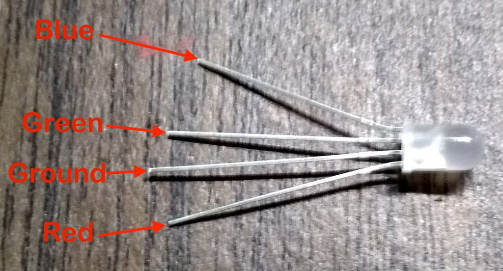

# RGB LED

Create your own colorful light show using an RGB LED.  By changing just three numbers, you can mix millions of different colors.

<video controls src="https://storage.googleapis.com/noah-education-videos/circuithackingmondays/arduino-rgbled.mov" ></video>

## Instructions

This uses the [standard setup instructions](index.md).

## Challenges


### ⭐ Easy

Can you make the LED:

- 🔴 Red
- 🟢 Green
- 🔵 Blue

---

### ⭐⭐ Medium

Can you make:

- 🟣 Purple
- 🟡 Yellow
- 🟠 Orange
- 🩷 Pink
- 🩵 Cyan
- ⚪ White

---

### ⭐⭐⭐ Design Challenge

Create your own color!

Give it a creative name and write down the RGB values.

Examples:

- 🐉 Dragon Fire
- ❄️ Frozen Ice
- 🍭 Bubblegum
- 👽 Alien Goo
- 🌊 Deep Ocean
- 🍋 Lemon Blast
- 💜 Mystic Purple
- 🌸 Cherry Blossom

**My Color Name:** _______________________

## Wiring




| RGB LED Connection   | Arduino Pin |
| -------------------- | ----------: |
| Red                  |          11 |
| Green                |          10 |
| Blue                 |           9 |
| Ground — longest leg |         GND |

Each red, green, and blue leg should use a resistor.

## Setup

This uses the [standard setup instructions](index.md).

### Starter Code

```cpp

// ==========================================
// PLAY AREA
// ==========================================

int red = 100;
int green = 0;
int blue = 100;

// ==========================================
// PINS
// ==========================================

int RED_PIN = 11;
int GREEN_PIN = 10;
int BLUE_PIN = 9;

void setup() {
  pinMode(RED_PIN, OUTPUT);
  pinMode(GREEN_PIN, OUTPUT);
  pinMode(BLUE_PIN, OUTPUT);

  analogWrite(RED_PIN, red);
  analogWrite(GREEN_PIN, green);
  analogWrite(BLUE_PIN, blue);
}

void loop() {
}
```

