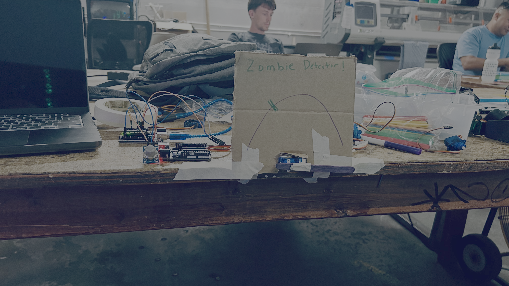
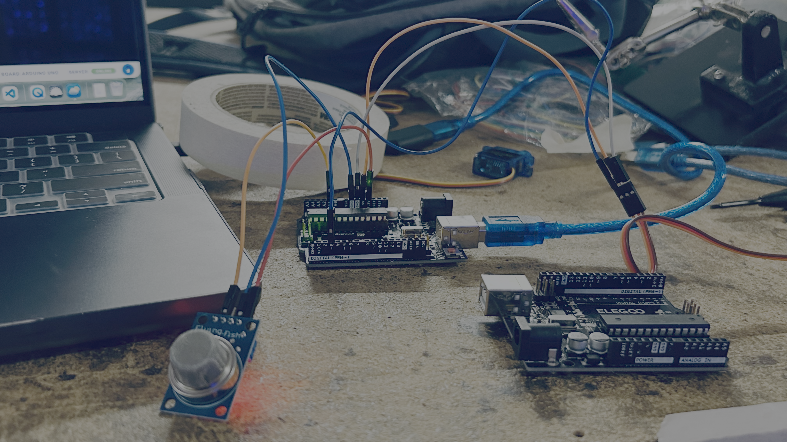
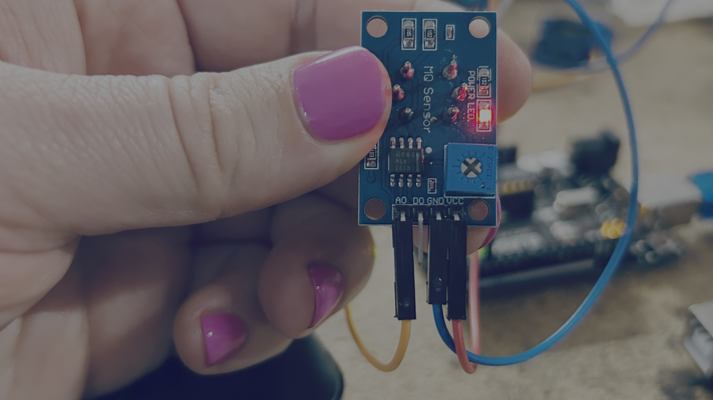

# Zombie Detector Gauge

## Project

Build a zombie detector using a gas sensor and a servo motor.

The gas sensor measures changes in the air. The Arduino converts the sensor reading into a servo angle, moving the gauge between different danger levels.

<video controls src="https://storage.googleapis.com/noah-education-videos/circuithackingmondays/zombie-detector.mov" ></video>




# Wires



## Gas Sensor



| Arduino Pin | Component | Component Pin |
| ------------ | --------- | ------------- |
| 5V           | Gas Sensor | VCC |
| GND          | Gas Sensor | GND |
| A1           | Gas Sensor | AO |

## Servo Motor

| Arduino Pin | Component | Wire Color |
| ------------ | --------- | ---------- |
| 5V           | Servo | Red |
| GND          | Servo | Brown or Black |
| D3           | Servo | Orange, Yellow, or White |


# Code

```cpp
#include <Servo.h>

Servo gauge;

void setup() {
  pinMode(A1, INPUT);

  Serial.begin(115200);

  gauge.attach(3);
}

void loop() {
  int readout = analogRead(A1);

  Serial.print("READOUT: ");
  Serial.println(readout);

  int angle = 180 - map(
    constrain(readout, 140, 170),
    140,
    170,
    0,
    180
  );

  Serial.print("ANGLE: ");
  Serial.println(angle);

  gauge.write(angle);

  delay(1000);
}
```

## Try Changing the Code

### Change the sensor range

```cpp
constrain(readout, 140, 170)
```

Try making the numbers bigger or smaller to change how sensitive the detector is.

### Change the speed

```cpp
delay(1000);
```

Try:

```cpp
delay(250);
```

or

```cpp
delay(100);
```

to make the gauge update faster.

---

# Memories

